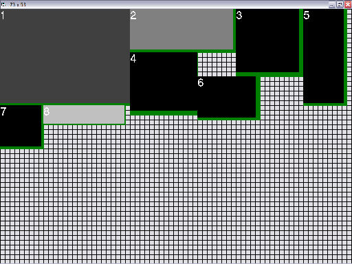



## Occupied Space Test

### Description

This is a test of an Occupied Space algorithm. It organizes objects (Pictureboxes, controls, etc.) on the screen in as little space as possible. The objects can be justified to the top, left, right, and bottom of the screen.
 
### More Info
 
Run the Program, then click on the form (not on the pictureboxes) to redraw with the next Justification (top, left, right, or bottom).

             |
---                |---
**Submitted On**   |2005-04-10 17:46:52
**By**             |[Kevin N\.](https://github.com/Planet-Source-Code/PSCIndex/blob/master/ByAuthor/kevin-n.md)
**Level**          |Beginner
**User Rating**    |4.8 (19 globes from 4 users)
**Compatibility**  |VB 6\.0
**Category**       |[Miscellaneous](https://github.com/Planet-Source-Code/PSCIndex/blob/master/ByCategory/miscellaneous__1-1.md)
**World**          |[Visual Basic](https://github.com/Planet-Source-Code/PSCIndex/blob/master/ByWorld/visual-basic.md)
**Archive File**   |[Occupied\_S1875034102005\.zip](https://github.com/Planet-Source-Code/kevin-n-occupied-space-test__1-59932/archive/master.zip)

